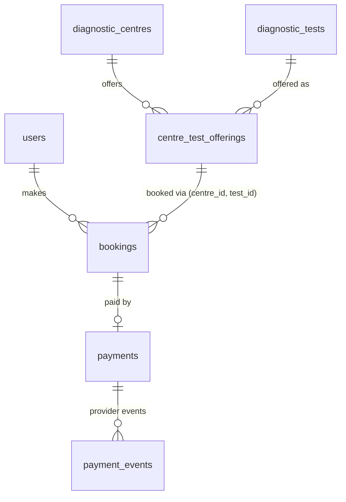
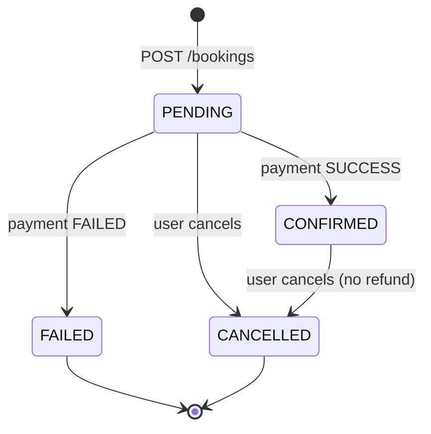

# EVE Healthcare — Diagnostic Booking Service

A backend for booking diagnostic tests at diagnostic centres, with a **simulated payment service**
and an **idempotent payment webhook**. Built for the EVE Healthcare SDE Intern backend assignment.

**Contents:** [Overview](#1-project-overview) · [Tech stack](#2-tech-stack) ·
[Architecture](#3-architecture) · [Database](#4-database-design) · [Auth](#5-authentication--authorization) ·
[API](#6-api-endpoints) · [Booking flow](#7-booking--payment-flow) ·
[Webhook idempotency](#8-webhook-idempotency) · [Edge cases](#9-edge-cases) ·
[Local setup](#10-local-setup) · [Assumptions](#11-assumptions) · [Improvements](#12-what-i-would-improve-with-more-time)

---

## 1. Project overview

- Users **sign up and log in** (JWT). An admin **manages diagnostic centres, tests and prices**.
- The same test can have a **different price at each centre** (a test _offering_).
- Users **book** a test at a centre for a future time. The booking starts **PENDING** and its amount
  is taken from the centre's price — never from the client.
- Users **pay** through a **mock payment provider** (no real gateway). The outcome is applied
  immediately or later by the provider's **webhook**, and the booking becomes **CONFIRMED** or
  **FAILED**.
- The webhook is **idempotent**: repeated or conflicting provider events can never duplicate
  payments or corrupt booking state.

## 2. Tech stack

| Area          | Choice                                                   | Why                                                                      |
| ------------- | -------------------------------------------------------- | ------------------------------------------------------------------------ |
| Runtime / API | Node.js, **Express 5**, **TypeScript**                   | Express 5 forwards async errors to the error handler natively            |
| Database      | **PostgreSQL** + **Prisma** ORM                          | Relational data, transactions, constraints; typed queries and migrations |
| Auth          | **JWT** (`jsonwebtoken`, HS256), **bcrypt** (`bcryptjs`) | Stateless auth; salted, slow password hashing                            |
| Validation    | **Zod**                                                  | Strict request schemas with typed output                                 |
| Tests         | **Jest** + **Supertest**                                 | API integration tests against a real test database                       |

`package.json` / `package-lock.json` serve as the requirements file (the Node.js equivalent of
`requirements.txt`). No Docker is used.

## 3. Architecture

```
Client ─► Express route ─► middleware ─► controller ─► service ─► repository ─► PostgreSQL
                          (authenticate,                (business   (Prisma
                           requireAdmin,                 rules)      queries)
                           verifyWebhookSecret,
                           validate)
          Any error thrown at any step ─► errorHandler ─► consistent JSON error
```

| Layer (`src/`)  | Responsibility                                                                                                                                                                        |
| --------------- | ------------------------------------------------------------------------------------------------------------------------------------------------------------------------------------- |
| `routes/`       | Map URLs to controllers and attach middleware per route (e.g. admin-only writes)                                                                                                      |
| `middleware/`   | `authenticate` (JWT → `req.user`), `requireAdmin`, `verifyWebhookSecret`, `validate` (Zod), `errorHandler`, `notFound`                                                                |
| `validators/`   | Zod schemas for bodies and URL params                                                                                                                                                 |
| `controllers/`  | HTTP only: read the validated request, call a service, choose the status code                                                                                                         |
| `services/`     | Business rules: pricing, ownership, the booking state machine, payment settlement, webhook idempotency. Services that need atomicity open the transaction and pass it to repositories |
| `repositories/` | All Prisma queries (the only layer that queries the database)                                                                                                                         |
| `utils/`        | `AppError`, JWT and password helpers, `bookingStatus` (state machine), structured JSON `logger`                                                                                       |
| `config/`       | Environment validation (the app refuses to start on bad config) and the Prisma client                                                                                                 |

`createApp()` (`app.ts`) is separate from `server.ts`, so tests exercise the app without opening a port.

## 4. Database design



| Table                   | Key columns and constraints                                                                                                                                                                                      |
| ----------------------- | ---------------------------------------------------------------------------------------------------------------------------------------------------------------------------------------------------------------- |
| `users`                 | name, **unique** lowercase email, bcrypt `password_hash`, `role` enum `USER`/`ADMIN` (default `USER`)                                                                                                            |
| `diagnostic_centres`    | name, free-text `location`; **unique (name, location)**                                                                                                                                                          |
| `diagnostic_tests`      | **unique** name, optional description                                                                                                                                                                            |
| `centre_test_offerings` | `centre_id`, `test_id`, `price_paise`; **unique (centre_id, test_id)**; **CHECK price_paise > 0**                                                                                                                |
| `bookings`              | `user_id`, `centre_id`, `test_id`, `appointment_date_time` (timestamptz), `amount_paise` (CHECK > 0), status enum; **composite FK (centre_id, test_id) → offering**; **partial unique index** on active bookings |
| `payments`              | **unique `booking_id`** (one per booking), `amount_paise` (CHECK > 0), status `PENDING`/`SUCCESS`/`FAILED`, **unique `provider_payment_id`**                                                                     |
| `payment_events`        | **unique `provider_event_id`**, `payment_id`, status (CHECK SUCCESS/FAILED), `outcome`, raw JSON `payload`                                                                                                       |

All foreign keys are `ON DELETE RESTRICT`: nothing that bookings depend on can be deleted.

**Why `centre_test_offerings` instead of test IDs on the centre?** Centres and tests are
many-to-many, and the **price belongs to the pair**, not to the test (the seed data has CBC at ₹350,
₹399 and ₹420 at three centres). A join table lets the database enforce what a JSON list of IDs
couldn't: foreign keys (the test must exist), uniqueness (no duplicate offering), a positive-price
CHECK, and bookings that reference an offering.

**How the booking amount is determined.** `POST /bookings` looks up the offering for the chosen
centre and test and copies its `price_paise` into `bookings.amount_paise`. The client cannot send an
amount (strict schema → 400). This is a **snapshot**: a later price change doesn't affect existing
bookings. Money is stored as **integer paise** (`35000` = ₹350.00) to avoid floating-point errors.

**Only offered tests can be booked.** The service returns 422 if the centre doesn't offer the
test, and the **composite foreign key** `bookings(centre_id, test_id) → centre_test_offerings`
guarantees it at the database level too.

**Payment → Booking.** Each payment points to one booking, and `payments.booking_id` is **unique**:
a booking has at most one payment. Because a FAILED booking is terminal (the user books again),
a booking is never paid twice — the database itself blocks double payment. There are no payment
columns on `bookings`.

**Payment events.** Every webhook event is stored in `payment_events`; its unique
`provider_event_id` is the database-level idempotency guarantee (section 8).

**Duplicate bookings.** A partial unique index on `(user_id, centre_id, test_id,
appointment_date_time) WHERE status IN ('PENDING','CONFIRMED')` blocks double-clicked duplicates, while
a cancelled or failed slot can be booked again.

The CHECK constraints and partial index are hand-written SQL in the migrations (Prisma's schema
language can't express them); `prisma migrate dev` was verified not to drop them. The six
migrations reflect iterative development (e.g. the centre–test join table gained its own id, and
payments moved to one-per-booking); they were always applied to empty tables, and applying them in
order to an empty database produces exactly the schema described here.

### Transaction boundaries

| Operation                                  | Mechanism                                                         | Why                                                   |
| ------------------------------------------ | ----------------------------------------------------------------- | ----------------------------------------------------- |
| Payment (`POST /payments`)                 | Interactive transaction + `SELECT … FOR UPDATE` on the booking    | Several reads and two writes depend on current status |
| Webhook processing                         | Transaction + booking row lock; event row in the same transaction | An event can never be recorded without its effect     |
| Cancellation                               | One conditional `UPDATE … WHERE status IN (…)`                    | A single statement is already atomic                  |
| Signup, catalogue writes, booking creation | Single `INSERT`, guarded by unique constraints / FKs              | One statement; no multi-step invariant                |

## 5. Authentication & authorization

- **Signup** `POST /auth/signup` — email is trimmed and lowercased (so `A@x.com` and `a@x.com`
  are the same account); password 8 characters to **72 bytes** (bcrypt's limit), hashed with
  bcrypt (cost 10). **Signup always creates a `USER`**: a `role` field in the body is ignored.
- **Login** `POST /auth/login` — returns a JWT (HS256, 1 hour, claims `sub`, `email`, `role`).
  Unknown email and wrong password return the **same** 401 and take similar time (a dummy bcrypt
  comparison), so emails can't be enumerated.
- **Protected endpoints** need `Authorization: Bearer <token>`. `authenticate` verifies signature,
  expiry and algorithm (pinned to HS256) and sets `req.user` from the token — no database lookup.
- **Admin role.** Creating/editing centres, tests and prices requires `authenticate` +
  `requireAdmin` (401 without a token, 403 for a normal user). The role is read from the token.
  The only admin is created by the **seed script** from `ADMIN_*` environment variables.
- **Ownership.** Booking queries always filter by the user from the token, so another user's
  booking returns **404** (not 403) — its existence is never revealed. Admins see only their own
  bookings too.
- **Webhook** requests are authenticated by an `X-Webhook-Secret` header (constant-time comparison),
  not a JWT.

## 6. API endpoints

| Method | Endpoint                           | Auth           | Purpose                                                        |
| ------ | ---------------------------------- | -------------- | -------------------------------------------------------------- |
| GET    | `/health`                          | –              | Liveness check                                                 |
| POST   | `/auth/signup`                     | –              | Register (always `USER`)                                       |
| POST   | `/auth/login`                      | –              | Get a JWT                                                      |
| GET    | `/centres`                         | –              | List centres                                                   |
| GET    | `/centres/:centreId`               | –              | One centre                                                     |
| POST   | `/centres`                         | Admin          | Create a centre `{ name, location }`                           |
| GET    | `/tests`                           | –              | List the test catalogue                                        |
| POST   | `/tests`                           | Admin          | Create a test `{ name, description? }`                         |
| GET    | `/centres/:centreId/tests`         | –              | Tests offered at a centre, with that centre's price            |
| POST   | `/centres/:centreId/tests`         | Admin          | Offer a test at a centre `{ testId, pricePaise }`              |
| PATCH  | `/centres/:centreId/tests/:testId` | Admin          | Change the price `{ pricePaise }`                              |
| POST   | `/bookings`                        | User           | Book `{ centreId, testId, appointmentDateTime }`               |
| GET    | `/bookings`                        | User           | Your bookings, newest first (with payment)                     |
| GET    | `/bookings/:id`                    | User           | One of your bookings                                           |
| PATCH  | `/bookings/:id/cancel`             | User           | Cancel one of your bookings                                    |
| POST   | `/payments`                        | User           | Pay for your PENDING booking `{ bookingId, simulateOutcome? }` |
| POST   | `/payments/webhook/`               | Webhook secret | Provider reports a payment outcome                             |

### Response format and status codes

Success: `{ "data": … }`. Every error has the same shape:

```json
{ "error": { "code": "VALIDATION_ERROR", "message": "Request validation failed", "details": { … } } }
```

| Status | Meaning                                                                                  |
| ------ | ---------------------------------------------------------------------------------------- |
| 200    | OK — including a webhook that was applied, a duplicate, or a conflict                    |
| 201    | Created — including a payment whose outcome is `FAILED`                                  |
| 202    | Accepted — payment created `PENDING`, awaiting the webhook                               |
| 400    | Invalid payload, malformed JSON or malformed UUID                                        |
| 401    | Missing, invalid or expired JWT; missing or wrong webhook secret                         |
| 403    | Authenticated, but not an admin, on an admin-only write                                  |
| 404    | Not found — **or owned by another user**                                                 |
| 409    | Duplicate record, or a state that doesn't allow the action                               |
| 413    | Request body larger than 100 kb                                                          |
| 415    | Unsupported request body encoding                                                        |
| 422    | Well-formed but invalid combination: test not offered at centre; webhook amount mismatch |
| 500    | Unexpected error (generic message; details only in the server log)                       |

### Example requests

Responses below were captured from the built server (`npm start`) on a freshly seeded database;
IDs and tokens are shortened with `…`.

```bash
# Sign up, then log in
curl -X POST http://localhost:3000/auth/signup -H "Content-Type: application/json" \
  -d '{"name":"Asha Rao","email":"asha@example.com","password":"password123"}'
# 201 {"data":{"id":"ed142df0-…","name":"Asha Rao","email":"asha@example.com","role":"USER","createdAt":"2026-09-30T05:46:13.966Z"}}

curl -X POST http://localhost:3000/auth/login -H "Content-Type: application/json" \
  -d '{"email":"asha@example.com","password":"password123"}'
# 200 {"data":{"accessToken":"eyJhbGciOiJIUzI1NiIs…","tokenType":"Bearer","expiresIn":"1h","user":{…,"role":"USER"}}}

# Tests offered at a centre, with that centre's price (abbreviated to the first entry)
curl http://localhost:3000/centres/<centreId>/tests
# 200 {"data":[{"id":"cd08e11a-…","centreId":"74ff0be3-…","testId":"3e8948d8-…","pricePaise":35000,
#       "test":{"id":"3e8948d8-…","name":"Complete Blood Count (CBC)","description":"Measures red cells, white cells and platelets."}}, …]}

# Admin creates a centre (a normal user's token gets 403 FORBIDDEN "Admin access required")
curl -X POST http://localhost:3000/centres -H "Authorization: Bearer <adminToken>" \
  -H "Content-Type: application/json" -d '{"name":"Wellness Labs","location":"Salt Lake, Kolkata"}'
# 201 {"data":{"id":"885f681e-…","name":"Wellness Labs","location":"Salt Lake, Kolkata",…}}

# Book a test (the amount comes from the centre's price; the time is returned in UTC)
curl -X POST http://localhost:3000/bookings -H "Authorization: Bearer <token>" \
  -H "Content-Type: application/json" \
  -d '{"centreId":"<centreId>","testId":"<testId>","appointmentDateTime":"2031-01-15T10:30:00+05:30"}'
# 201 {"data":{"id":"bfc75421-…","appointmentDateTime":"2031-01-15T05:00:00.000Z","amountPaise":35000,
#       "status":"PENDING","payment":null,"centre":{"name":"HealthFirst Diagnostics",…},"test":{"name":"Complete Blood Count (CBC)",…},…}}
# Same request with "amount":1 → 400 VALIDATION_ERROR (Unrecognized key: "amount")
# A test the centre doesn't offer → 422 {"error":{"code":"TEST_NOT_OFFERED","message":"This centre does not offer the selected test"}}

# Pay; without simulateOutcome the payment waits for the webhook
curl -X POST http://localhost:3000/payments -H "Authorization: Bearer <token>" \
  -H "Content-Type: application/json" -d '{"bookingId":"<bookingId>"}'
# 202 {"data":{"id":"215a2e5b-…","bookingId":"bfc75421-…","amountPaise":35000,"status":"PENDING",
#       "providerPaymentId":"mock_pay_4dde13e7-…","booking":{"id":"bfc75421-…","status":"PENDING"}}}
# With "simulateOutcome":"FAILED" → 201 {"data":{…,"status":"FAILED","booking":{…,"status":"FAILED"}}}

# The provider's webhook settles it (sending the same event again returns the identical response)
curl -X POST http://localhost:3000/payments/webhook/ -H "X-Webhook-Secret: <WEBHOOK_SECRET>" \
  -H "Content-Type: application/json" \
  -d '{"eventId":"evt_1001","providerPaymentId":"mock_pay_4dde13e7-…","status":"SUCCESS","amount":35000}'
# 200 {"data":{"eventId":"evt_1001","providerPaymentId":"mock_pay_4dde13e7-…","status":"SUCCESS","outcome":"APPLIED"}}
# Without the header → 401 {"error":{"code":"INVALID_WEBHOOK_SECRET","message":"Missing or invalid webhook secret"}}

curl http://localhost:3000/bookings/<bookingId> -H "Authorization: Bearer <token>"
# 200 {"data":{"id":"bfc75421-…","amountPaise":35000,"status":"CONFIRMED",
#       "payment":{"id":"215a2e5b-…","status":"SUCCESS","providerPaymentId":"mock_pay_4dde13e7-…","amountPaise":35000,…},…}}
```

## 7. Booking & payment flow



The allowed transitions are defined once (`src/utils/bookingStatus.ts`) and reused by
cancellation, payments and the webhook. **FAILED and CANCELLED are terminal**; a booking can't be
paid or cancelled after its appointment time.

A payment is settled in one of two ways — both go through the same `settlePayment()` function:

```
Synchronous:   POST /payments {bookingId, simulateOutcome: SUCCESS|FAILED}          → 201, booking CONFIRMED|FAILED
Asynchronous:  POST /payments {bookingId}                                           → 202, payment PENDING, booking PENDING
               POST /payments/webhook/ {eventId, providerPaymentId, status, amount} → 200, booking CONFIRMED|FAILED
```

`POST /payments` locks the booking row (`SELECT … FOR UPDATE`) and checks it's the caller's,
PENDING, not already paid and not in the past, all in one transaction. Two simultaneous payments —
or a payment and a cancel — are serialised: exactly one wins (tested with `Promise.all`).

## 8. Webhook idempotency

**Why duplicates happen.** Payment providers deliver webhooks _at least once_: they retry until
they receive a 2xx, so timeouts, slow responses or their own retry logic can deliver the **same
event several times** — possibly at the same moment — and events can arrive out of order.

**Idempotency works at two levels:**

1. **Same event delivered again** — every event carries a provider `eventId`, stored as
   `payment_events.provider_event_id` with a **UNIQUE** constraint. A repeat is recognised and the
   **stored result is returned** (identical `200` body every time). If two copies race, the database
   accepts only one insert; the other's transaction rolls back and it replies with the committed
   result. If the same `eventId` arrives with a _different_ body, the first delivery counts; the
   difference is logged.
2. **Same outcome under a new event ID** — the event is recorded, but `settlePayment()` sees the
   payment is already in that status and changes nothing (`outcome: DUPLICATE_STATE`).

**Late or conflicting events never corrupt state.** A payment moves `PENDING → SUCCESS | FAILED`
exactly once:

| Situation                                     | Result                                                                                                                                 | `outcome`          |
| --------------------------------------------- | -------------------------------------------------------------------------------------------------------------------------------------- | ------------------ |
| PENDING payment + SUCCESS / FAILED            | Payment settled; booking → CONFIRMED / FAILED                                                                                          | `APPLIED`          |
| Payment already in the reported status        | Nothing changes                                                                                                                        | `DUPLICATE_STATE`  |
| Payment SUCCESS, then FAILED                  | Keeps SUCCESS; warning logged                                                                                                          | `IGNORED_CONFLICT` |
| Payment FAILED, then SUCCESS                  | Keeps FAILED (terminal); logged `MANUAL_RECONCILIATION_REQUIRED` — in a real system money was taken, so a human must refund or confirm | `IGNORED_CONFLICT` |
| Booking CANCELLED while pending, then SUCCESS | Payment → SUCCESS, booking **stays CANCELLED**; logged `REFUND_REQUIRED`                                                               | `APPLIED`          |

**Retries are safe because it's one transaction.** Recording the event and applying its effect
happen in the **same database transaction** (with the booking row locked). If processing fails
halfway, both roll back and the provider's retry is processed cleanly. If the event were committed
separately, a crash before the update would make every retry look like a duplicate and the payment
would never settle. A test simulates exactly this crash.

The webhook **never creates payments or bookings** — it only updates an existing payment and its
booking — and requires the `X-Webhook-Secret` header. Responses: `200` (applied, duplicate or
conflict — an error would make the provider retry forever), `400` invalid payload, `401` bad secret,
`404` unknown `providerPaymentId`, `422` amount mismatch (nothing recorded). An unknown **event ID**
is not an error: it just means the event is new.

## 9. Edge cases

Every case below has at least one automated test.

| Area      | Case                                                        | Status              | Handled in                                                 |
| --------- | ----------------------------------------------------------- | ------------------- | ---------------------------------------------------------- |
| Auth      | Invalid signup payload                                      | 400                 | `validators/auth.validator.ts`                             |
| Auth      | Duplicate email (any letter case, incl. concurrent signups) | 409                 | lowercased email; unique `users.email`                     |
| Auth      | Wrong password / unknown email (same message and timing)    | 401                 | `auth.service.ts` (dummy bcrypt compare)                   |
| Auth      | Password over 72 **bytes** (signup and login)               | 400                 | `auth.validator.ts`                                        |
| Auth      | `role: ADMIN` in signup body                                | 201 as USER         | Zod strips it; DB default `USER`                           |
| Auth      | Missing / malformed / invalid / expired JWT, `alg: none`    | 401                 | `middleware/authenticate.ts`, `utils/jwt.ts`               |
| Catalogue | Malformed UUID / missing fields / bad price                 | 400                 | `validators/centre.validator.ts`; DB CHECK                 |
| Catalogue | Non-admin write / no token                                  | 403 / 401           | `middleware/requireAdmin.ts`                               |
| Catalogue | Unknown centre or test                                      | 404                 | `services/centre.service.ts`                               |
| Catalogue | Duplicate offering, test name, centre                       | 409                 | unique constraints                                         |
| Bookings  | No token                                                    | 401                 | `routes/booking.routes.ts`                                 |
| Bookings  | Unknown centre or test                                      | 404                 | `services/booking.service.ts`                              |
| Bookings  | Test not offered by the centre                              | 422                 | service check + composite FK                               |
| Bookings  | Client sends `amount` / `status`                            | 400                 | strict schema                                              |
| Bookings  | Past / timezone-less / invalid appointment time             | 400                 | `validators/booking.validator.ts`                          |
| Bookings  | Malformed / unknown booking ID                              | 400 / 404           | validator / owner-filtered query                           |
| Bookings  | Viewing or cancelling another user's booking                | 404                 | `WHERE id AND user_id` in `booking.repository.ts`          |
| Bookings  | Cancel twice / cancel FAILED / cancel after appointment     | 409                 | conditional UPDATE + state machine                         |
| Bookings  | Duplicate active booking (double click)                     | 409                 | partial unique index                                       |
| Payments  | Unknown booking / another user's booking                    | 404                 | owner-filtered row lock                                    |
| Payments  | Booking FAILED / CANCELLED / past appointment               | 409                 | state machine check under the lock                         |
| Payments  | Duplicate payment (incl. while PENDING, incl. concurrent)   | 409                 | row lock + unique `payments.booking_id`                    |
| Payments  | Client sends `amount`                                       | 400                 | strict schema                                              |
| Payments  | Failed payment                                              | 201                 | not an error: `status: FAILED`                             |
| Webhook   | Missing / wrong secret                                      | 401                 | `middleware/verifyWebhookSecret.ts`                        |
| Webhook   | Invalid payload / `PENDING` status / malformed JSON         | 400                 | strict schema                                              |
| Webhook   | Unknown `providerPaymentId` / amount mismatch               | 404 / 422           | `services/webhook.service.ts`                              |
| Webhook   | Repeated SUCCESS / FAILED (incl. concurrent)                | 200                 | unique `provider_event_id`; stored result replayed         |
| Webhook   | Same outcome, new event ID / conflicting outcome            | 200                 | `settlePayment()` → `DUPLICATE_STATE` / `IGNORED_CONFLICT` |
| Webhook   | Crash mid-processing                                        | 500, retry succeeds | single transaction rolls back                              |
| General   | Unknown route or method                                     | 404 (JSON)          | `middleware/notFound.ts`                                   |
| General   | Body over 100 kb / unsupported encoding                     | 413 / 415           | `middleware/errorHandler.ts`                               |
| General   | Unexpected / database error                                 | 500                 | generic body; details only in the log                      |
| General   | Password or hash in any response                            | never               | `select` on user queries; sweep test                       |

## 10. Local setup

**Requirements:** Node.js 20+ and PostgreSQL (developed and tested with Node.js 24 and
PostgreSQL 18). Commands are for a bash-style shell (Git Bash on Windows); on PowerShell use `copy`
instead of `cp`.

```bash
# 1. Install dependencies (also generates the Prisma client via postinstall)
npm install

# 2. Create a development and a separate test database
createdb -U postgres eve_healthcare
createdb -U postgres eve_healthcare_test

# 3. Environment variables — copy the examples and edit the values
cp .env.example .env              # DATABASE_URL (dev DB), JWT_SECRET, WEBHOOK_SECRET, ADMIN_*
cp .env.test.example .env.test    # DATABASE_URL must point to the *test* database

# 4. Apply the migrations to both databases
npm run db:deploy
npm run db:test:deploy

# 5. Seed: the admin account (from ADMIN_NAME / ADMIN_EMAIL / ADMIN_PASSWORD in .env)
#    plus 3 centres, 5 tests and 10 offerings with centre-specific prices
npm run db:seed

# 6. Run
npm run dev                       # http://localhost:3000/health  (auto-reload)
npm run build && npm start        # compiled production build
```

| Variable                                      | Purpose                                                  |
| --------------------------------------------- | -------------------------------------------------------- |
| `DATABASE_URL`                                | PostgreSQL connection string                             |
| `JWT_SECRET`                                  | HS256 signing secret (≥ 16 characters)                   |
| `JWT_EXPIRES_IN`                              | Token lifetime: `3600`, `15m`, `1h`, `7d` (default `1h`) |
| `WEBHOOK_SECRET`                              | Shared secret the provider sends in `X-Webhook-Secret`   |
| `ADMIN_NAME`, `ADMIN_EMAIL`, `ADMIN_PASSWORD` | The admin account created by `npm run db:seed`           |
| `PORT`, `NODE_ENV`                            | Server port (default 3000) and environment               |

The app validates these at startup and refuses to start if any is missing or invalid. `.env`
files are git-ignored; only the `.example` files (with placeholder values) are committed.

Other scripts: `npm run lint`, `npm run typecheck`, `npm run format`, `npm run db:migrate`
(create a new migration after editing `prisma/schema.prisma`).

### Tests

```bash
npm test                          # 186 tests against the test database
npm test -- --coverage            # ~95% statements, ~85% branches
```

Jest + Supertest against a real PostgreSQL test database — no database mocks, test containers,
fixture libraries or snapshots. One file per module (`foundation`, `auth`, `catalogue`,
`bookings`, `payments`, `webhook`, `security`, `seed`). Each test creates its own data with small
factories (`tests/helpers/factories.ts`), the database is emptied before every test, files run one
at a time (they share one database), dates are relative to "now", and there are no timing-based
waits — races are tested with `Promise.all`.

### What the tests prove

| Guarantee                                                               | Proven by (file › test)                                                                                                                                                                                                             |
| ----------------------------------------------------------------------- | ----------------------------------------------------------------------------------------------------------------------------------------------------------------------------------------------------------------------------------- |
| **Webhook idempotency** — the same event applied once                   | `webhook` › _webhook idempotency — the same event E1 delivered twice_                                                                                                                                                               |
| …even when delivered concurrently                                       | `webhook` › _the same event sent 5 times concurrently is applied exactly once_                                                                                                                                                      |
| …and when a new event ID repeats an outcome                             | `webhook` › _is recorded as DUPLICATE_STATE and changes nothing_                                                                                                                                                                    |
| **Webhook atomicity** — a crash never leaves an event half-applied      | `webhook` › _a crash after settling but before saving the event rolls both back…_                                                                                                                                                   |
| **No invalid state changes** from late/conflicting events               | `webhook` › _conflicting events_ (3 tests); `bookings` › _booking state machine_                                                                                                                                                    |
| **No double payment**                                                   | `payments` › _lets exactly one of two simultaneous payments succeed_                                                                                                                                                                |
| **Amount integrity** — clients can't set prices; bookings keep theirs   | `bookings` › _returns 400 for a client-supplied amount…_, _keeps the booked amount when an admin later changes the price_; `payments` › _charges the booking amount…_; `webhook` › _returns 422 for an amount that does not match…_ |
| **Ownership** — users can't see, cancel or pay others' bookings         | `bookings` › _returns 404 (not 403) when fetching another user's booking_, _…cancelling another user's booking_; `payments` › _returns 404 when paying for another user's booking_                                                  |
| **Authorization** — only admins manage the catalogue; no self-promotion | `catalogue` › _returns 403 for a normal user…_; `auth` › _ignores a role in the request body…_                                                                                                                                      |
| **Only offered tests are bookable** (service + composite FK)            | `bookings` › _returns 422 when the centre does not offer the test_, _is refused by the database…_                                                                                                                                   |
| **Webhook authenticity**                                                | `webhook` › _returns 401 for a missing/wrong secret_                                                                                                                                                                                |
| **No sensitive data leaks**                                             | `security` › _no response … contains a password or password hash_; `foundation` › _error handler_                                                                                                                                   |

## 11. Assumptions

- **Roles:** there is one admin, created by the seed script; only admins manage centres, tests and
  prices. There is no API to promote users. The role is read from the JWT, so a role change applies
  at the next login.
- **Ownership:** another user's booking returns 404, not 403. Admins have no special access to
  bookings.
- **Payments:** one payment per booking. A **FAILED booking is terminal** — the user creates a new
  booking to try again. `simulateOutcome` is chosen by the client **only because the provider is a
  mock**; omitting it leaves the payment PENDING for the webhook.
- **Cancellation:** allowed from PENDING or CONFIRMED and before the appointment time. Cancelling a
  CONFIRMED booking does **not** refund (refunds are out of scope).
- **Duplicates:** the same user can't hold two active (PENDING/CONFIRMED) bookings for the same
  test, centre and time.
- **Webhooks:** conflicts are recorded and logged, never applied (table in section 8). For the same
  event ID with a different body, the first delivery counts. Authentication is a shared secret header.
  The webhook body schema is strict (unknown fields → 400) because the provider is mocked; a real
  integration would accept unknown fields, since rejecting them would make the provider retry forever.
- **Money** is INR in integer paise, from 1 paise to ₹1,00,000 per offering; no currency column.
- **Time:** stored as `timestamptz`; `appointmentDateTime` must be ISO 8601 **with a timezone** and
  in the future; responses are in UTC. There is no slot or capacity management.
- **Catalogue:** a centre's `location` is free text; centres are unique by (name, location) so a chain
  can have several branches; names are case-sensitive. There are **no DELETE endpoints** — removing
  data that bookings reference would break booking history (an "active" flag would be the way).
- **Auth:** emails are case-insensitive; passwords are 8 characters to 72 bytes; tokens last 1 hour
  with no refresh tokens or revocation.
- No helmet, CORS or rate limiting: the API returns only JSON and has no browser front end in scope.

## 12. What I would improve with more time

- **`Idempotency-Key` header on `POST /payments`**, so a client retrying after a timeout gets the
  original payment instead of a 409.
- **Refunds** for cancelled CONFIRMED bookings and for `REFUND_REQUIRED` events.
- **A reconciliation job/report** for `IGNORED_CONFLICT` and `MANUAL_RECONCILIATION_REQUIRED` events.
- **HMAC-signed webhooks** (signature over the raw body plus a timestamp) instead of a static shared
  secret; with a real gateway, call the provider outside the database transaction.
- **Operational extras:** Docker Compose, OpenAPI documentation, pagination, rate limiting, and
  caching of the public catalogue (e.g. Redis).
